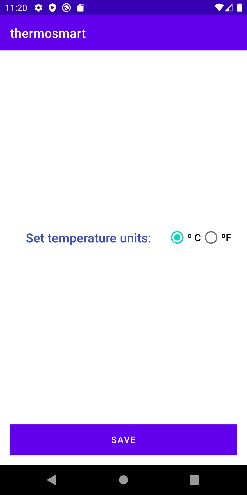
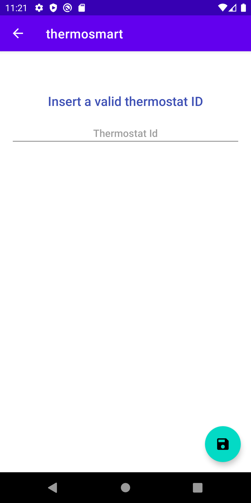

## Design Document
---
### Main Objective

This app is intended to manage multiple thermostats. Using this app you are able to configure a threshold temperature to activate your home heater. The app will receive messages and will notify when the thermostat has been activated or deactivated.
In Addition will show the weather of the thermostat location. It is possible to show different units of temperature measurement. 

---
### Implementations

- Login to the app with your user via email or google account using firebase authentication.
- Use a firebase real time database to manage thermostat configurations.
- Use live data objects to provide data from database to the views.
- Use android shared preferences interface to configure your units preferences ºC / ºF.
- The user managed thermostats are shown in a ReciclerView.
- ConstraintLayouts are mostly used in all layouts.
- Thermostat location can be selected using google maps sdk.
- Map will use the device location to move the camera there when no marker selected, otherwise, camera is moved to the marker.
- Application manages firebase messages to trigger notifications thermostat is activated/deactivated in backgorund and foreground.
- Thermostat loaction weather temperature is be shown using openweathermap api.
- Thermostat loaction weather image is be shown using openweathermap api.
- Floating button in ThermostatListFragment is animated on load.

---
### Layouts

  - LoginActivity


  - ThermostatListFragment 
  


  - AppConfigFragment



  - ThermostatSaveFragment



  - ThermostatDetailFragment


  - ThermostatConfigFragment


  - SelectLocationFragment


---
### Notes
- to simulate a thermostat temperature change, a similator is provided for the device "dev1" https://thermosmart-b5382.web.app
- firebase real time database [datamodel](datamodel.png)

---
### Milestones
- v1: design document and dummy app (21/12/2021).
- v2: be able to add and remove thermostats to the managed thermostats list using the firestore realtime database (22/12/2021).
- v3: add notifications and fetch external data using openweathermap api (23/12/2021).
- v4: add animations and style (24/12/2021).

---
### Rubric requirements

**Android UI/UX**
- *Application includes at least three screens with distinct features using either the Android Navigation Controller or Explicit Intents.*
  -  yes, include more than 3 and Android Navigation Controller it's being used
- *The Navigation Controller is used for Fragment-based navigation and intents are utilized for Activity-based navigation.*
  - Navigation controler is used for fragments navigation and activity intents for notification actions.
- *An application bundle is built to store data passed between Fragments and Activities.*
  - application bundle is used to pass data to the activity when a notification has been received.
- *Application UI effectively utilizes ConstraintLayout to arrange UI elements effectively and efficiently across application features, avoiding nesting layouts and maintaining a flat UI structure where possible.*:
  - Yes, constraint layouts are used.
- *Data collections are displayed effectively, taking advantage of visual hierarchy and arrangement to display data in an easily consumable format.*
  - List of thermostats is shown using the recyclerview.
- *Resources are stored appropriately using the internal res directory to store data in appropriate locations including string values, drawables, colors, dimensions, and more*
  - Yes, resources are stored there.
- *Every element within ConstraintLayout should include the id field and at least 1 vertical constraint*
  - all of them includes constrains and ids.
- *Data collections should be loaded into the application using ViewHolder pattern and appropriate View, such as RecyclerView*
  - List of thermostats is shown using the recyclerview.
- *Application contains at least 1 feature utilizing MotionLayout to adapt UI elements to a given function. This could include animating control elements onto and off screen, displaying and hiding a form, or animation of complex UI transitions.*
  - In ThermostatListFragment floating button has a motion transition implemented when load fragment, and in addition the alpha is modified.
- *MotionLayout behaviors are defined in a MotionScene using one or more Transition nodes and ConstraintSet blocks.*
  - Yes, it's being used
- *Constraints are defined within the scenes and house all layout params for the animation*
  - Done

**Local and Network data**
- *The Application connects to at least 1 external data source using Retrofit or other appropriate library/component and retrieves data for use within the application.*
  - It connects to openweather and download the weather of the thermostat location.
- *Data retrieved from the remote source is held in local models with appropriate data types that are readily handled and manipulated within the application source. Helper libraries such as Moshi may be used to assist with this requirement.*
  - Yes, it's held in data classes
```java
data class WeatherData(
    val icon: String
)

data class MainData(
    val temp: Float
)

data class OpenWeatherResponseData(
    val name: String,
    val weather: List<WeatherData>,
    val main: MainData
)
```
- *The application performs work and handles network requests on the appropriate threads to avoid stalling the UI.*
  - Yes, it's done in viewmodel scope.
- *The Application loads remote resources asynchronously using an appropriate library such as Glide or other library/component when needed.*
  - Picasso library is being used to render the weather icon.
- *Images display placeholder images while being loaded and handle failed network requests gracefully.*
  - loading and broken image is being shown.
- *All requests are performed asynchronously and handled on the appropriate threads.*
  - yes, it's
- *The application utilizes storage mechanisms that best fit the data stored to store data locally on the device. Example: SharedPreferences for user settings or an internal database for data persistence for application data. Libraries such as Room may be utilized to achieve this functionality*
  - Units preference is stored using SharedPreferences database and thermostats and user config is stored using firebase realtime sdk.
- *Data stored is accessible across user sessions.*
  - Yes, it is.
- *Data storage operations are performed on the appropriate threads as to not stall the UI thread.*
  - yes, all database work is done using tasks and result listener.
- *Data is structured with appropriate data types and scope as required by application functionality.*
  - Data and domain models are implemented.

**Android system and hardware integration**
- *Architect application functionality using MVVM.*
  - Yes it's
- *Implement logic to handle and respond to hardware and system events that impact the Android Lifecycle.*
  - Notifications are using a background service and all location permissions are propperly managed.
- *Utilize system hardware to provide the user with advanced functionality and features.*
  - App is using notifications and location.


